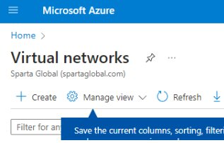
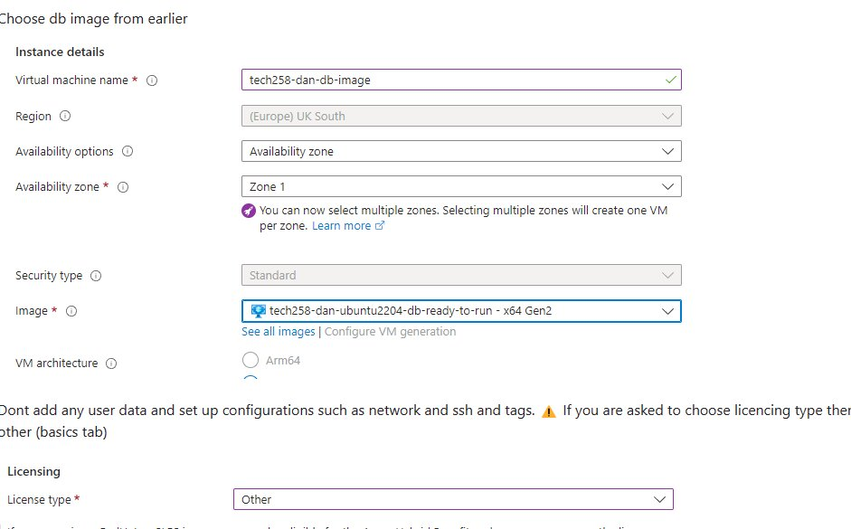
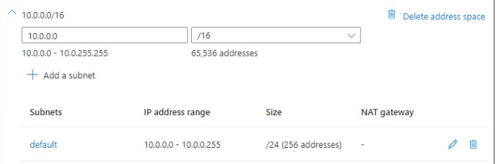
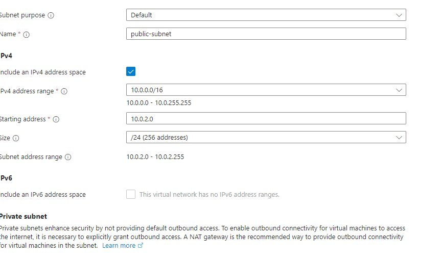
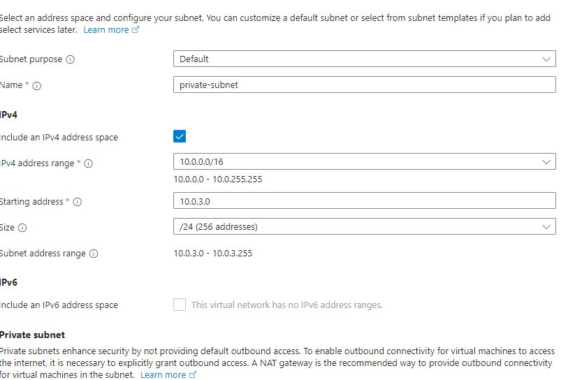
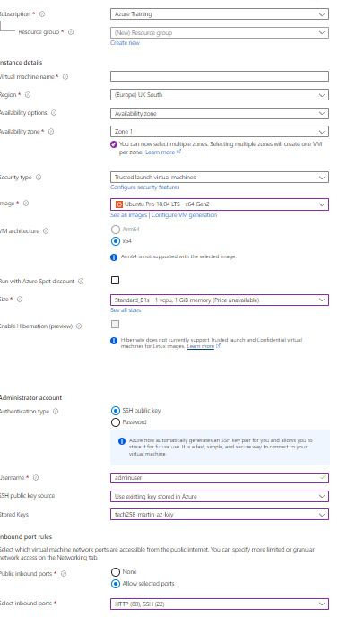

# Two Tier deployment on Azure 


*******************************************

## Step 1 : Generate the SSH key

* We need to generate the ssh key first to use with Azure. 
* So open gitbash , cd into your ssh dolder and type the follwing command 

```python
ssh-keygen -t rsa -b 4096 -C "<YOUR_EMAIL>
```

* After its generated make sure toaccess the pem file so you can see your public key. : Yo ucan do that by the follwing command 

```
cat <keyname.pem>
```

* You should be able to see your full public key...keep this ready we going to need it for AZURE.

## Step 2 : Log into Azure Portal 

* Open your web browser and navigate to the Azure Portal.
* Enter your Azure account credentials (username and password) and click "Sign in".


## Step 3  : Navigate to resource group 

* Click on resource groups. 

* You should be presented with a page where you can click the basic tab.
*  Once there make sure to pick the correct resource group(in our case it will be tech258)
* Make sure to rename the key pair name. Its best practice it to call it the same name as how you named it in your .sh folder
* Then click upload existing public key resource. 
* Bring up gitbash and copy your public key.pem then paste it in the upload key box on Azure
* Once done click submit 

## Step 5 : Fill out correct tags 

* After you have submitted you should have been presaented with a page called tags.
* Its important that you change the name option to owner and the value option to your name
  

*********************************

# Deploy your first virtual machine 

## Step 1 : Create a virtual network (VNet)

"VNet" typically refers to a Virtual Network. In the context of computing and networking, a Virtual Network (VNet) is a simulated network infrastructure that provides the same functionalities and capabilities as a physical network but is created using software rather than hardware.

* In the left-hand menu, click on "Create a resource."
 * Search for "Virtual network" and select create.
    



* Once created navigate to the basics tab and make sure the details are the same as the one below : 




* Navigate to the ip address tab
  



* Click on "Subnets" and add two subnets:

* The first one should be called **public-subnet** and the Address range should be **10.0.2.0/24**




* The second one should be called **private-subnet** and the Address range should be **10.0.3.0/24**



* Make sure to add your tags to **Owner** and yout value to your **name**


Review and create the VNet. 

## Step 2 : Create your virtual machine

* Navigate to the Azure portal and Click on "Create a resource" and search for "Virtual machine." Select it.
Fill in the required details:

* This is going to be important when it comes to deploying our db and application 
  


* your settings should look like this
  


* Tags: Add a tag for the owner.

## Step 3 : Repeat step 2

* Do exactly what you did again to vcreate the vm for your application.


